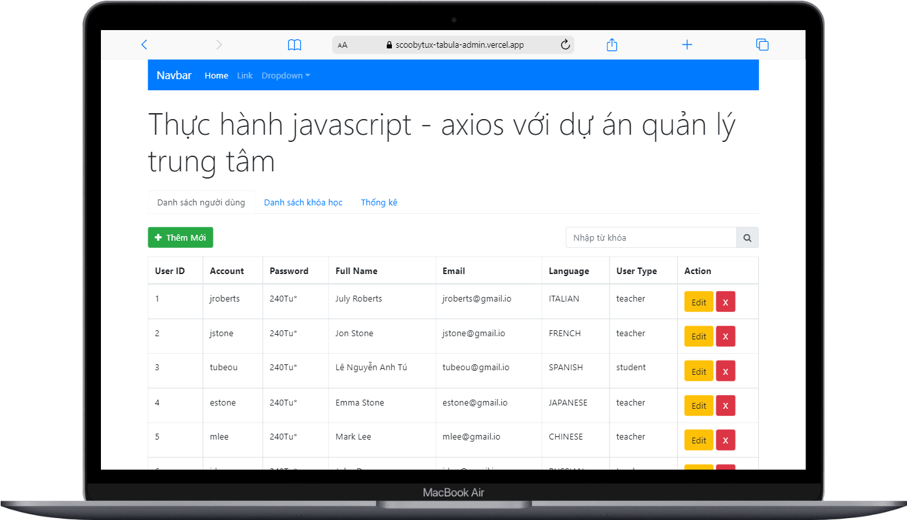
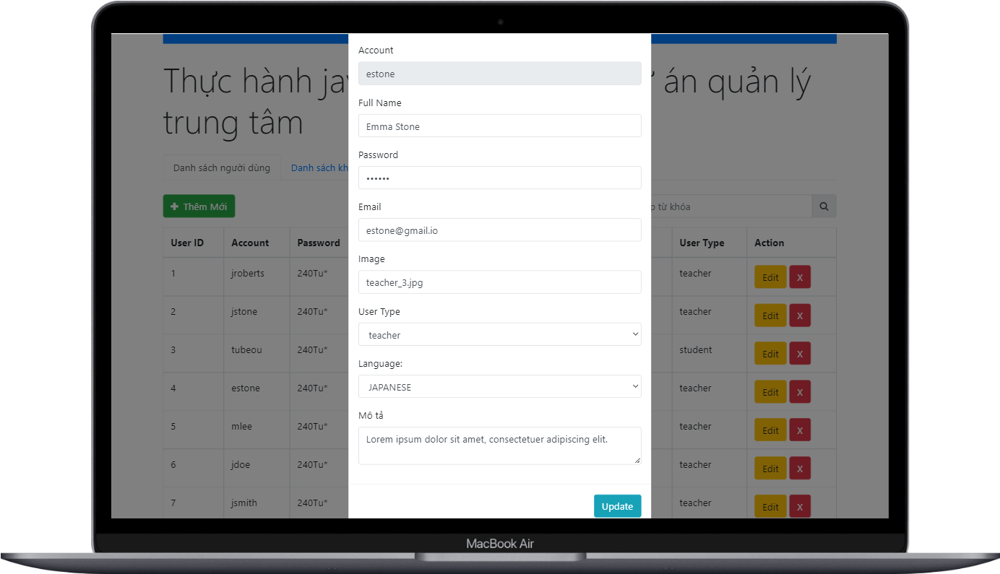

# Tabula

See the admin page [Tabula's Admin Page](https://scoobytux-tabula-admin.vercel.app/ "Tabula's Admin Page") 🎆

Client page [Tabula's Client Page](https://scoobytux-tabula.vercel.app/ "Tabula's Client Page") ([source code](https://github.com/scoobytux/tabula "Tabula's Client Page Source Code")) 🎆

## Introduction

Tabula project with admin and client pages build with JavaScript, Axios, HTML, CSS (SCSS), Bootstrap.

Admin can add, delete or update the user at the admin page. The user information displays on client page.

## Tasks and Roadmap

> Apr 19 ‑ 29, 2022

### Admin Page

- [x] Created mock API using MockAPI tool. Check out: [API](https://625bc0d1398f3bc782ae7e06.mockapi.io/api/users "API").
- [x] Called the mock API to implement add, delete, update user and display the user list.
- [x] Validated inputs when adding or updating user information.

### Client Page

- [x] Crafted the homepage layout from the original website. Made the experts section display dynamically using data from API.
- [x] Made responsive web design on devices.

<!-- ## Project Structure

```
$PROJECT_ROOT
│   # Resource files
├── assets
│   │   # Image files
│   ├── images
│   │   # JavaScript files
│   ├── js
│   │   # Scss files
│   ├── scss
│   │   # CSS files
│   └── styles
│   # Screenshots of the project
├── screenshots
│   # Page content
└── index.html
``` -->

### Installation and Run

### Admin Page

Check out the webpage -> [Tabula's Admin Page](https://scoobytux-tabula-admin.vercel.app/ "Tabula's Admin Page") or run locally:

- `git clone https://github.com/scoobytux/tabula-admin.git`
- `cd tabula-admin`
- Open `index.html` file

### Client Page

Check out the webpage -> [Tabula's Client Page](https://scoobytux-tabula.vercel.app/ "Tabula's Client Page") or run locally:

- `git clone https://github.com/scoobytux/tabula.git`
- `cd tabula`
- Open `index.html` file

## Tabula's Admin Page Views





